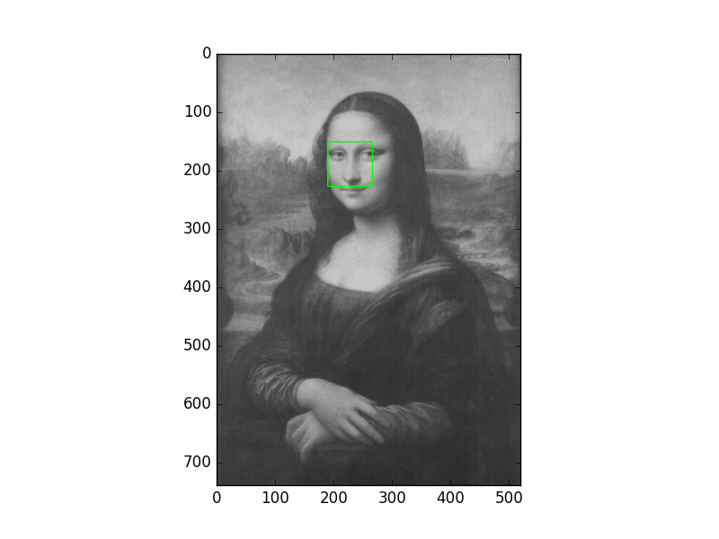
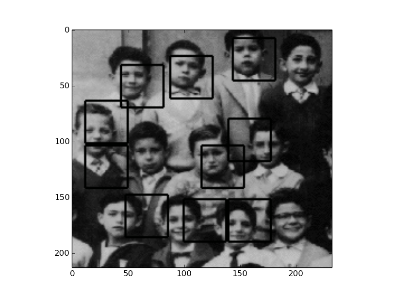
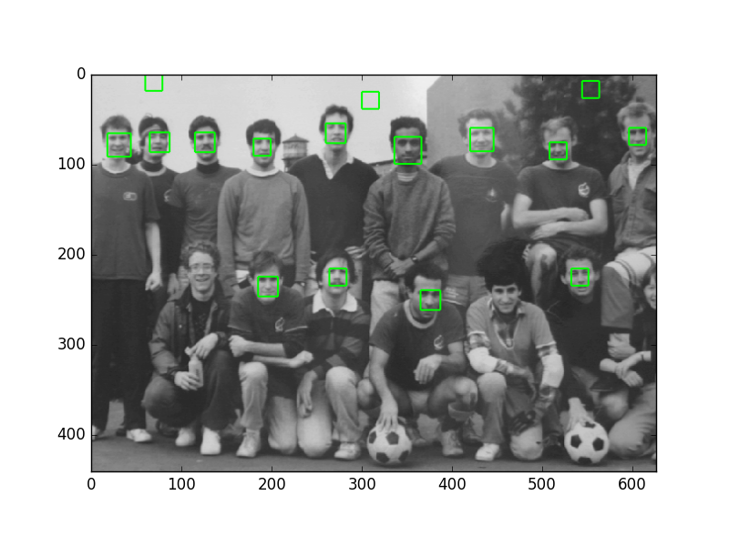

# EFace -- A project of face detection in Python

  

This project name as `E-Face` which is a implementation of face detection algorithm.

My nick name is `EOF`. For convenient, I name it as `E-Face`.

It's stimulating to do this project.
Enjoy with it.

### The architecture of this project.

The following list show the files in this awesome project.

* adaboost.py 
Implementation of Adaptive Boosting algorithm

* cascade.py
Cascade Decision Tree

* config.py
All parameters of configuration in this project are stored in this file.

* image.py
The initialization of images. class Image and class ImageSet are in this file.

* haarFeature.py
Stuff with Haar-Features.

* weakClassifier.py
The detail about Weak classifier.

* training.py
Script for training the model.

directories:

* model/
    cache files for adaboost model.

* featuers/
    values for different feaures with different samples.

* doc/
    documents with this project.

### Usage:
For training a adaboost model:

         python ./trainingAdaBoost.py

To detect faces in a image, you have to define the **TEST_IMG** which is the path where store your image:
      
        python ./EFace.py
        
### Presentation of current result:
I'm still working on making this project more powerful. So, here is the
presentation of **current** result.

### Programming Style:

I used basic OOP(Object Oriented Programming) tricks to build my program. Something like... I put all about `AdaBoost` into a class(AdaBoost) which you can find in file `adaboost.py`. Everytime you want to do something with adaboost, just create a object instance of that class.

Adavantages of this style:
    Higher level of abstraction and easy to be used. With this style, green hand will easy to build good archtecture with our project.

Disadvantages of this style:
    Without optimalization, it will cost a lot of memory. 
    This will be obvious when the scale of project goes more and more large.

During this period when I working on the project,
I meet a lots of problem. But I also want to say "thanks" to these problem. It help me a lot to enhance my ability in programming.

* Exception Handle
    The training process cost too much time. Sometimes, we have a better idea to change the code into a better version. But the trainning process is going on. If we press `ctrl + c` to interrupt, the data that we have get from the `AdaBoost` process will lost.

    I use a handler for `KeyboardInterrupt` and then save the data of model so that the valuable data won't be lose.

* High Performance Programming in Python

    There have lots of tricks to make native Python code run more faster. The computation of image processing is very huge. This means that it's a typical problem about CPU-bound.

* Concurrent Control
   To improve the performance of this system in the training process, 
   I try to use parallel mechanism with the two CPU in my workstation.
    
... ...

---

### Optimization diary

2016-04-09 Restart to built this project and finished optimize the image.py

2016-04-13 refactor the training.py and make it more light. create a new module mapReduce.py. In haarFeature.py, @idxVector is initialized by numpy.zeros, it's faster than numpy.array([0 for i in range(length)])

2016-04-15 going to optimal weakClassifier.py and adaboost.py. Try to vectorize weakclassifier.py

2016-04-16 change scanImage.py and use different size of final classifier image but not resize the inputed image.

